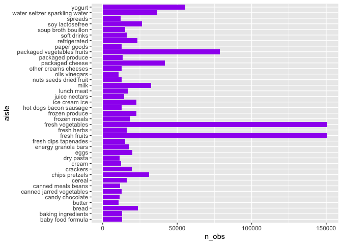
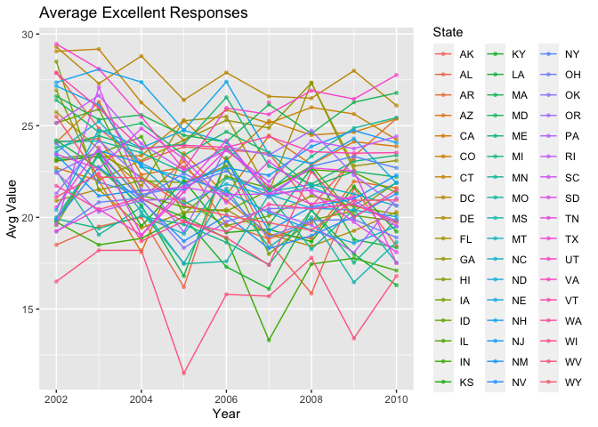
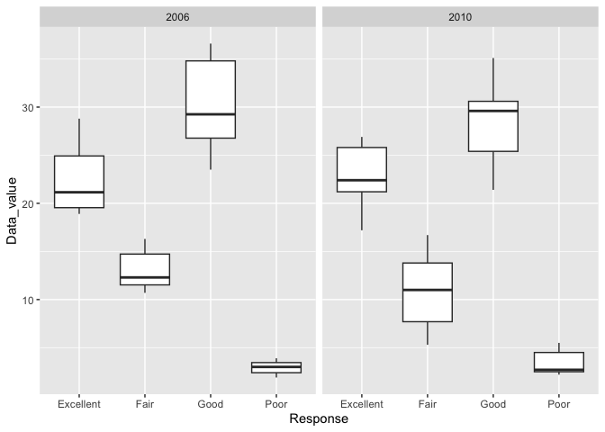
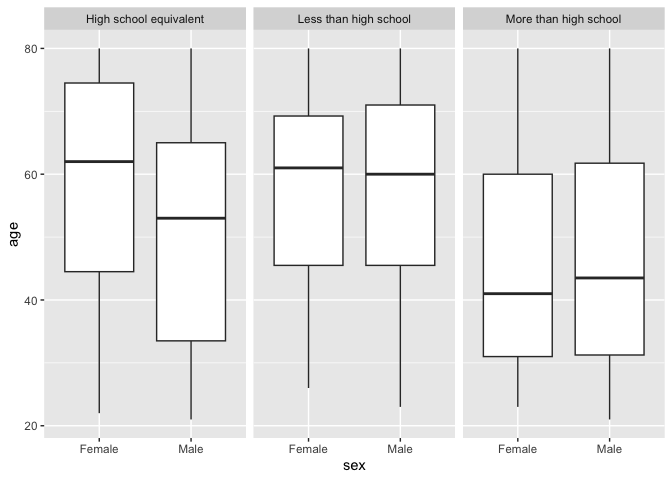
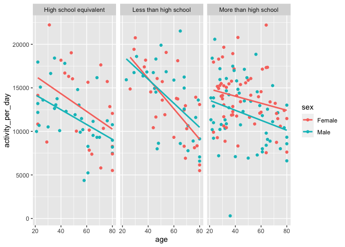
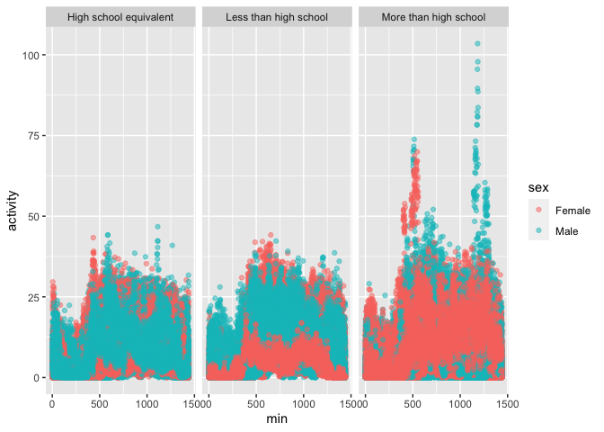

P_8105_HW3
================
Arthur Starodynov
2023-10-14-23

Start the homework by loading the data set.

``` r
library(tidyverse)
```

    ## ── Attaching core tidyverse packages ──────────────────────── tidyverse 2.0.0 ──
    ## ✔ dplyr     1.1.3     ✔ readr     2.1.4
    ## ✔ forcats   1.0.0     ✔ stringr   1.5.0
    ## ✔ ggplot2   3.4.3     ✔ tibble    3.2.1
    ## ✔ lubridate 1.9.2     ✔ tidyr     1.3.0
    ## ✔ purrr     1.0.2     
    ## ── Conflicts ────────────────────────────────────────── tidyverse_conflicts() ──
    ## ✖ dplyr::filter() masks stats::filter()
    ## ✖ dplyr::lag()    masks stats::lag()
    ## ℹ Use the conflicted package (<http://conflicted.r-lib.org/>) to force all conflicts to become errors

``` r
library(p8105.datasets)
library(ggplot2)
library(scrutiny)
```

Here we start to examine the insta cart data sets that are available for
use from the database for the class.

``` r
insta_df <- data(instacart)
```

``` r
instacart %>% 
  group_by(aisle) %>%
  summarize(
    n_obs = n()
    ) %>%
  arrange(desc(n_obs))
```

    ## # A tibble: 134 × 2
    ##    aisle                          n_obs
    ##    <chr>                          <int>
    ##  1 fresh vegetables              150609
    ##  2 fresh fruits                  150473
    ##  3 packaged vegetables fruits     78493
    ##  4 yogurt                         55240
    ##  5 packaged cheese                41699
    ##  6 water seltzer sparkling water  36617
    ##  7 milk                           32644
    ##  8 chips pretzels                 31269
    ##  9 soy lactosefree                26240
    ## 10 bread                          23635
    ## # ℹ 124 more rows

``` r
instacart %>%
  group_by(aisle_id)%>%
  summarize(n_obs = n()) %>%
  nrow()
```

    ## [1] 134

``` r
instacart %>%
  group_by(aisle_id)%>%
  summarize(n_obs = n()) %>%
  max()
```

    ## [1] 150609

Through this R code above we can see that there are a total of 134
aisles with fresh vegetables being the most ordered from, followed by
fresh fruits, and then packages vegetables fruits.

``` r
numbs_df = 
  instacart %>% 
  group_by(aisle) %>%
  summarize(
    n_obs = n()
    ) %>%
  filter(n_obs > 10000)

ggplot(numbs_df, aes(x = n_obs , y = aisle)) +
  geom_bar(fill = "purple", stat = "identity")
```

<!-- -->

Above is a clean plot showing the number of observations seeen within
each aisle when speicified each aisle to have more than 10,000
observations.

``` r
aisle_df = 
  instacart %>%
  group_by(aisle) %>%
  filter(aisle == c("baking ingredients" , "dog food care", "packaged vegetables fruits")) 
```

    ## Warning: There were 104 warnings in `filter()`.
    ## The first warning was:
    ## ℹ In argument: `aisle == c("baking ingredients", "dog food care", "packaged
    ##   vegetables fruits")`.
    ## ℹ In group 1: `aisle = "air fresheners candles"`.
    ## Caused by warning in `aisle == c("baking ingredients", "dog food care", "packaged vegetables fruits")`:
    ## ! longer object length is not a multiple of shorter object length
    ## ℹ Run `dplyr::last_dplyr_warnings()` to see the 103 remaining warnings.

``` r
aisle_df %>% 
  group_by(add_to_cart_order) %>%
  summarize(count = n())
```

    ## # A tibble: 58 × 2
    ##    add_to_cart_order count
    ##                <int> <int>
    ##  1                 1  2295
    ##  2                 2  2584
    ##  3                 3  2552
    ##  4                 4  2546
    ##  5                 5  2364
    ##  6                 6  2129
    ##  7                 7  1917
    ##  8                 8  1786
    ##  9                 9  1649
    ## 10                10  1420
    ## # ℹ 48 more rows

``` r
aisle_df
```

    ## # A tibble: 31,064 × 15
    ## # Groups:   aisle [3]
    ##    order_id product_id add_to_cart_order reordered user_id eval_set order_number
    ##       <int>      <int>             <int>     <int>   <int> <chr>           <int>
    ##  1       38      21616                 4         1   42756 train               6
    ##  2       96      39275                 7         1   17227 train               7
    ##  3       98      18117                30         1   56463 train              41
    ##  4      170      18394                 1         1  182389 train               7
    ##  5      170      11182                16         0  182389 train               7
    ##  6      631      42265                 3         1  184099 train               7
    ##  7      878      21903                 5         1   61911 train               9
    ##  8     1001      43961                 4         1   47475 train              15
    ##  9     1143      27966                 4         1   79725 train              11
    ## 10     1143      27999                13         0   79725 train              11
    ## # ℹ 31,054 more rows
    ## # ℹ 8 more variables: order_dow <int>, order_hour_of_day <int>,
    ## #   days_since_prior_order <int>, product_name <chr>, aisle_id <int>,
    ## #   department_id <int>, aisle <chr>, department <chr>


    Below I have shown the three aisles shown with the most popular productrs bought from each

``` r
bake_df <- subset(instacart, aisle == "baking ingredients") %>% 
  group_by(product_name) %>% 
  summarise(count = n()) %>% 
  arrange(desc(count))
head(bake_df)
```

    ## # A tibble: 6 × 2
    ##   product_name                         count
    ##   <chr>                                <int>
    ## 1 Light Brown Sugar                      499
    ## 2 Pure Baking Soda                       387
    ## 3 Cane Sugar                             336
    ## 4 Premium Pure Cane Granulated Sugar     329
    ## 5 Organic Vanilla Extract                327
    ## 6 Organic Unbleached All-Purpose Flour   291

``` r
dog_df <- subset(instacart, aisle == "dog food care") %>% 
  group_by(product_name) %>% 
  summarise(count = n()) %>% 
  arrange(desc(count))
head(dog_df)
```

    ## # A tibble: 6 × 2
    ##   product_name                                    count
    ##   <chr>                                           <int>
    ## 1 Snack Sticks Chicken & Rice Recipe Dog Treats      30
    ## 2 Organix Chicken & Brown Rice Recipe                28
    ## 3 Small Dog Biscuits                                 26
    ## 4 Standard Size Pet Waste bags                       25
    ## 5 Organix Grain Free Chicken & Vegetable Dog Food    24
    ## 6 Chicken & Vegetable Snack Sticks for Dogs          23

``` r
veggie_df <- subset(instacart, aisle == "packaged vegetables fruits") %>% 
  group_by(product_name) %>% 
  summarise(count = n()) %>% 
  arrange(desc(count))
head(veggie_df)
```

    ## # A tibble: 6 × 2
    ##   product_name           count
    ##   <chr>                  <int>
    ## 1 Organic Baby Spinach    9784
    ## 2 Organic Raspberries     5546
    ## 3 Organic Blueberries     4966
    ## 4 Seedless Red Grapes     4059
    ## 5 Organic Grape Tomatoes  3823
    ## 6 Organic Baby Carrots    3597

## Problem 2

    First, we do some data cleaning:
    - format the data to use appropriate variable names
    - focus on the “Overall Health” 
    - include only responses from “Excellent” to “Poor”
    - organize responses as a factor taking levels ordered from “Poor” to “Excellent”

``` r
library(p8105.datasets)
data("brfss_smart2010")

brfss_df<- 
  brfss_smart2010 %>% 
  separate(Locationdesc, into = c("State", "County"), sep = "-") %>% 
  select(-c(Locationabbr)) %>%
  filter(Topic == "Overall Health", 
         Response %in% c("Poor", "Fair", "Good", "Very Good", "Excellent")) %>%
  mutate(Response = as.factor(Response))
```


    Now with this information we can answer the question of In 2002, which states were observed at 7 or more locations? What about in 2010?

``` r
brfss_df %>%
  filter(Year == 2002) %>%
  group_by(State) %>%
  summarize(num = n_distinct(GeoLocation)) %>%
  filter(num >= 7)
```

    ## # A tibble: 6 × 2
    ##   State   num
    ##   <chr> <int>
    ## 1 "CT "     7
    ## 2 "FL "     7
    ## 3 "MA "     8
    ## 4 "NC "     7
    ## 5 "NJ "     8
    ## 6 "PA "    10

``` r
brfss_df %>%
  filter(Year == 2010) %>%
  group_by(State) %>%
  summarize(num = n_distinct(GeoLocation)) %>%
  filter(num >= 7)
```

    ## # A tibble: 14 × 2
    ##    State   num
    ##    <chr> <int>
    ##  1 "CA "    12
    ##  2 "CO "     7
    ##  3 "FL "    41
    ##  4 "MA "     9
    ##  5 "MD "    12
    ##  6 "NC "    12
    ##  7 "NE "    10
    ##  8 "NJ "    19
    ##  9 "NY "     9
    ## 10 "OH "     8
    ## 11 "PA "     7
    ## 12 "SC "     7
    ## 13 "TX "    16
    ## 14 "WA "    10


    With this we can see which states in 2007 and 2010 were observed at 7 or more location. 

``` r
avg_df <- brfss_df %>%
    filter(Response == "Excellent") %>% 
    select(Year, State, GeoLocation, Data_value) %>%
    group_by(Year, State) %>%
    summarise(mean_data_value = mean(Data_value)) %>% 
    ungroup()
```


    The dataset is shown only for excellent responses for the overall health questions, with the average across the locations.


    Make a “spaghetti” plot of this average value over time within a state (that is, make a plot showing a line for each state across years – the geom_line geometry and group aesthetic will help).

``` r
ggplot(avg_df, aes(x = Year, y = mean_data_value, color = State)) +
  geom_point(size = 1, alpha = .6) + 
  geom_line() +
  labs(y = "Avg Value", title = "Average Excellent Responses")
```

<!-- -->


    Make a two-panel plot showing, for the years 2006, and 2010, distribution of data_value for responses (“Poor” to “Excellent”) among locations in NY State.

``` r
brfss_df %>% 
filter(Year %in% c(2006, 2010), 
         State == "NY ",
         !is.na(Response)) %>%
  select(Year, County, Response, Data_value) %>%
  arrange(Year, County, Response) %>%
  ggplot(aes(x = Response, y = Data_value)) +
  geom_boxplot() +
  facet_wrap(~Year)
```

<!-- -->

## Problem 3

    Load, tidy, merge, and otherwise organize the data sets. Your final dataset should include all originally observed variables; exclude participants less than 21 years of age, and those with missing demographic data; and encode data with reasonable variable classes (i.e. not numeric, and using factors with the ordering of tables and plots in mind).

``` r
library(readr)
```

``` r
covar_df <- read_csv("./nhanes_covar.csv") %>%
  row_to_colnames(row = 4) %>%
  slice_tail(n = 250) %>%
  mutate(SEQN = as.integer(SEQN), 
         sex = as.factor(case_when(sex == 1 ~ "Male", sex == 2 ~ "Female")), 
         age = as.integer(age), 
         BMI = as.double(BMI), 
         education = as.factor(case_when(education == 1 ~ "Less than high school",
                                         education == 2 ~ "High school equivalent",
                                         education == 3 ~ "More than high school"))) %>%
  na.omit() %>%
  filter(age >= 21)

accel_df <- read_csv("./nhanes_accel.csv")

combined_df <- left_join(covar_df, accel_df, by = "SEQN")
```

    Produce a reader-friendly table for the number of men and women in each education category, and create a visualization of the age distributions for men and women in each education category. Comment on these items.

``` r
combined_df %>% 
  group_by(education, sex) %>%
  summarize(`Number of People` = n()) %>%
  ungroup() %>%
  rename(Education = education, Sex = sex)
```

    ## `summarise()` has grouped output by 'education'. You can override using the
    ## `.groups` argument.

    ## # A tibble: 6 × 3
    ##   Education              Sex    `Number of People`
    ##   <fct>                  <fct>               <int>
    ## 1 High school equivalent Female                 23
    ## 2 High school equivalent Male                   35
    ## 3 Less than high school  Female                 28
    ## 4 Less than high school  Male                   27
    ## 5 More than high school  Female                 59
    ## 6 More than high school  Male                   56


     The lowest education and sex combination is Females with a high school or high school-equivalent degre
     

    Shown in graph below, females done with high school have higher median age than males and seen the same with the ones with same education as the males. 

``` r
combined_df %>%
  select(SEQN, sex, age, education) %>%
  ggplot(aes(x = sex, y = age)) +
  geom_boxplot() +
  facet_wrap(~education)
```

<!-- -->


    Traditional analyses of accelerometer data focus on the total activity over the day. Using your tidied dataset, aggregate across minutes to create a total activity variable for each participant. Plot these total activities (y-axis) against age (x-axis); your plot should compare men to women and have separate panels for each education level. Include a trend line or a smooth to illustrate differences. Comment on your plot.

``` r
nhames_new_df<- combined_df %>%
  mutate(activity_per_day = rowSums(select(., contains("min")))) %>%
  select(SEQN:education, activity_per_day)

ggplot(nhames_new_df, aes(x = age, y = activity_per_day, color = sex)) +
  geom_point() +
  geom_smooth(se = F, method = "glm") +
  facet_wrap(~education) 
```

    ## `geom_smooth()` using formula = 'y ~ x'

<!-- -->

    Accelerometer data allows the inspection activity over the course of the day. Make a three-panel plot that shows the 24-hour activity time courses for each education level and use color to indicate sex. Describe in words any patterns or conclusions you can make based on this graph; including smooth trends may help identify differences.

``` r
combined_df %>% 
  pivot_longer(cols = contains("min"), names_to = "minute", values_to = "activity") %>%
  separate(col = minute, "n", into = c("min_char", "min")) %>%
  mutate(min = as.integer(min)) %>%
  ggplot(aes(x = min, y = activity, color = sex)) +
  geom_point(alpha = 0.5) +
  facet_wrap(~education) 
```

<!-- -->
